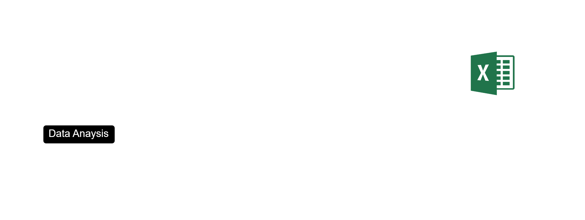

# 📊 Shopee Earphone Market Analysis  
End-to-end analytics project: web scraping with Puppeteer (Node.js) → data preprocessing (Python) → EDA & Dashboard (Power BI) → feature importance analysis (ML).

---

## 🚀 Project Overview
Pasar earphone di Shopee sangat kompetitif dengan ribuan produk yang memiliki harga, rating, spesifikasi, dan reputasi toko yang berbeda.
Tujuan proyek ini adalah:
- Mengumpulkan data produk earphone secara otomatis
- Mendesain dashboard untuk eksplorasi dan insight
- Menganalisis faktor yang paling berpengaruh terhadap penjualan
- Membantu buyer, dropshipper, dan seller untuk mengambil keputusan lebih tepat unutuk membeli atau menjual product terkait. Pertimbangan yang dimaksud dapat berupa harga, spesifikasi toko (shop), spesifikasi product dan lain sebagainya yang bahkan tidak tersedia di tampilan antarmuka Shopee, seperti: **Garansi (jenis garansi, tidak ada garansi), Tipe earphone (gaming/non-gaming) Cancellation rate toko serta Kategori advanced lainnya**.
---

## Metthodology
Adapun skema yang dijalankan:



### 🧩 Data Collection (Scraping)

Tools: Puppeteer (Node.js)
Output: [products_v2.json](shopee-scrapper/data/products_v2.json)

Pada tahap ini, data earphone dikumpulkan langsung dari Shopee menggunakan Puppeteer untuk mengekstrak informasi detail baik dari product maupun shop yang terkait. [Dataset Summary](#dataset-summary)


### 🧹 Data Cleaning & Transformation

Tools: Python (pandas, numpy), Notebook
Output: [shopee_data.xlsx](data/shopee_data.xlsx) 3 sheet: products, variants, shops
Dataset final diformat menjadi file Excel dengan sheet terpisah agar mudah di-load ke Power BI.

### 📊 Exploratory Data Analysis (Power BI Dashboard)

Dashboard Power BI dibangun berdasarkan dataset bersih (Excel output tahap Data Cleaning).
Tujuan EDA di Power BI untuk menjawab problem define. Selain itu Dashboard memudahkan user untuk menelusuri produk berdasarkan kategori tertentu dan menemukan peluang produk untuk dijual kembali (dropshipping) maupun analisis untuk pembeli.

### Feature Importance (Machine Learning)

Tools: Python (scikit-learn, statsmodels)

Setelah mendapatkan insight eksploratif dari dashboard, dataset dimanfaatkan untuk mencari faktor apa yang paling mempengaruhi penjualan menggunakan

### Conclusion
Setelah semua tahap sebelumnya selesai , selanjutnya informasi yang ada di simpulkan untuk menjawab probelm define

---


## 📁 Project Structure
```bash
shopee-earphone-analysis
├── data
│   └── shopee_data.xlsx
├── notebooks
│   ├── feature_importance.ipynb
│   └── shopee_EDA.ipynb
├── power-bi
│   └── dashboard.pbi
├── python_env
├── shopee-scrapper
│   ├── collector
│   ├── data
│   ├── scrapper
│   ├── utils
│   ├── app.mjs
│   ├── waitCaptcha.mjs
│   ├── package.json
│   └── package-lock.json
├── .gitignore
├── requirements.txt
└── README.md
```

---

## 📦 Dataset Summary

### **1️⃣ products**
Berisi detail produk earphone:
- `itemid`, `shopid`, `brand`, `price_min`, `price_max`, `price`,
- `price_before_discount`, `price_max_before_discount`,
- `price_min_before_discount`, `discount`, `historical_sold`, `sold`,
- `prod_rating`, `cmt_count`, `liked_count`, `stock`, `prod_ctime`,
- `image`, `total_rating_count`, `prod_rating1_count`,
- `prod_rating2_count`, `prod_rating3_count`, `prod_rating4_count`,
- `prod_rating5_count`, `product_age_days`, `Gaming`, `Jenis Garansi`,
- `Masa Garansi`, `Tipe Earphone, Headphone & Headset`, `Tipe Koneksi`

### **2️⃣ shops**
Informasi rating dan performa toko:
- `shopid`, `follower_count`, `shop_rating`, `shop_rating_good`,
- `shop_rating_normal`, `shop_rating_bad`, `response_rate`,
- `response_time`, `is_verified`, `is_official_shop`, `is_preferred_plus`,
- `has_shopee_flash_sale`, `item_count`, `shop_ctime`, `preparation_time`,
- `cancellation_rate`, `province`

### **3️⃣ variants**
Detail varian produk:
- `itemid`, `name`, `price`, `stock`,`variant_name`,`price_before_discount`

---

## 🧹 Data Cleaning
Hal yang dilakukan:
- Menghapus duplikasi
- Menstandarisasi kategori & tipe data
- Menangani missing values
- Memisahkan data produk–toko–varian

---

## 🔍 Exploratory Data Analysis (EDA)

Fokus utama:
### **📌 Market Landscape**
- Distribusi harga earphone di Shopee  
- Kategori brand populer  
- Analisis stok dan penjualan  

### **📌 Seller Characteristics**
- Performa seller berdasarkan lokasi  
- Followers vs rating vs penjualan  
- Perbedaan antara *official shop* vs non-official  

### **📌 Price & Sales Analysis**
- Hubungan harga dengan penjualan  
- Outlier detection  
- Distribusi rating dan ulasan  

---

## 🔗 Correlation Analysis

### **Metode yang digunakan:**
- **Spearman correlation** → Numerik vs numerik (karena banyak outlier)  
- **Cramér’s V** → Kategori vs kategori  
- **Kruskal–Wallis Test** → Numerik vs kategori  
- Scatter plot menggunakan **log-transform**  

### **Pertanyaan utama:**
- Apakah harga mempengaruhi penjualan?  
- Apakah rating berhubungan dengan sold?  
- Apakah seller “Preferred” menjual lebih banyak?  
- Brand mana yang memiliki performa paling stabil?  

---

## 📊 Dashboard (Power BI)

Dashboard mencakup:
- Distribusi harga  
- Brand performance  
- Rating & Penjualan  
- Seller overview  
- Lokasi toko  
- Insight per kategori brand / seller / harga

📁 File dashboard:  
`dashboard/shopee_dashboard.pbix`

---

## ⭐ Key Insights (Sample)
> *Insight ini dapat disesuaikan setelah analisis selesai.*

- Sebagian besar earphone dijual pada rentang **Rp20.000 – Rp150.000**  
- Toko *Preferred* memiliki median penjualan **lebih tinggi**  
- Rating berpengaruh positif terhadap sold, namun hubungan tidak linear  
- Banyak brand low-budget mendominasi jumlah produk namun tidak penjualan  
- Harga memiliki **non-linear pattern**, sehingga korelasi lebih stabil pada log-scale  

---

## ▶️ How to Run

### **Install dependency**


npm install
pip install -r requirements.txt


### **Run scraper**


node scripts/scrape.js


### **Run analysis**


jupyter notebook

Buka file:


notebooks/03_eda.ipynb


---

## 📬 Contact  
**Author:** Erick Delenia  
- Instagram: @yourusername  
- Email: your@email.com  

Project ini dibuat sebagai portofolio profesional untuk posisi **Data Analyst / Data Scientist**.
