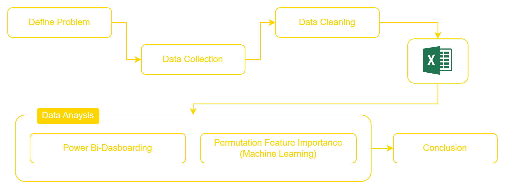
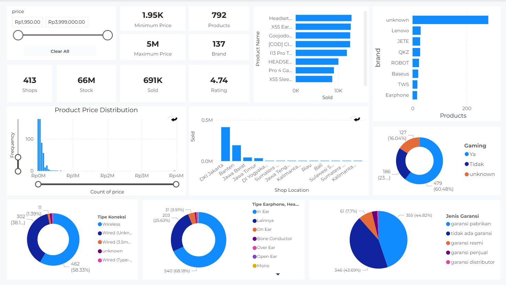
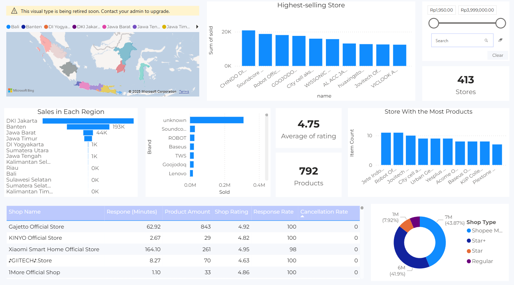
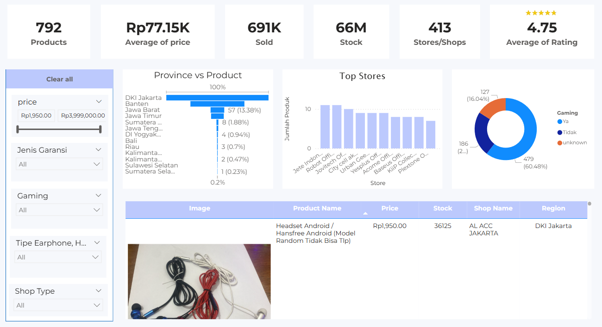
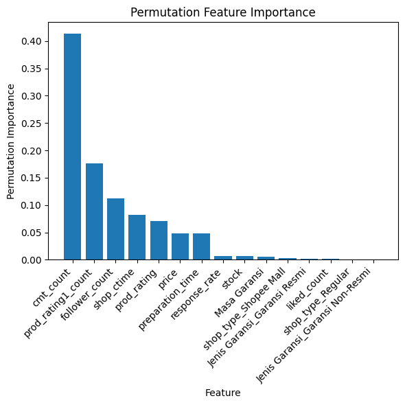

# 📊 Shopee Earphone Market Analysis  
End-to-end analytics project: web scraping with Puppeteer (Node.js) → data preprocessing (Python) → EDA & Dashboard (Power BI) → feature importance analysis (ML).

---

## 🚀 Project Overview
Pasar earphone di Shopee sangat kompetitif dengan ribuan produk yang memiliki harga, rating, spesifikasi, dan reputasi toko yang berbeda. Proyek ini menganalisis pasar earphone di Shopee Indonesia untuk memberikan insight terkait produk dan penjualan. Fokus utama proyek adalah:  
1. Memberikan gambaran umum market earphone, termasuk brand dan produk paling laku serta sebaran toko.  
2. Mempermudah pencarian produk dengan filtrasi yang lebih lengkap dan detail dibanding antarmuka Shopee. Filtrasi yang dimaksud dapat berupa harga, spesifikasi toko (shop), spesifikasi product dan lain sebagainya yang bahkan tidak tersedia di tampilan antarmuka Shopee, seperti: **Garansi (jenis garansi, tidak ada garansi), Tipe earphone (gaming/non-gaming) Cancellation rate toko serta Kategori advanced lainnya**.
3. Menganalisis fitur atau kriteria yang paling berpengaruh terhadap penjualan earphone.  

Proses proyek mencakup pengumpulan data dari API Shopee, pembersihan data, visualisasi dashboard, dan analisis feature importance menggunakan metode non-parametrik dan Random Forest.

---

## 🎯 Problem Statement
- Produk apa yang paling banyak terjual?  
- Brand apa yang paling laris?  
- Variasi harga earphone (minimum & maksimum)?  
- Toko mana yang paling laku?  
- Sebaran toko earphone?  
- Faktor apa saja yang mempengaruhi penjualan earphone?  
- Bagaimana filter tambahan di Power BI bisa mempermudah buyer/dropshipper memilih produk terbaik?

---

## Metthodology
Adapun skema yang dijalankan:



### 🧩 Data Collection (Scraping)

Tools: Puppeteer (Node.js)
Output: [products_v2.json](shopee-scrapper/data/products_v2.json)

Pada tahap ini, data earphone dikumpulkan langsung dari Shopee menggunakan Puppeteer untuk mengekstrak informasi detail baik dari product maupun shop yang terkait. 

[Lihat Dataset Summary](#-dataset-summary)


### 🧹 Data Cleaning & Transformation

Tools: Python (pandas, numpy), Notebook
Output: [shopee_data.xlsx](data/shopee_data.xlsx) 3 sheet: products, variants, shops
Dataset final diformat menjadi file Excel dengan sheet terpisah agar mudah di-load ke Power BI.

### 📊 Exploratory Data Analysis (Power BI Dashboard)

Dashboard Power BI dibangun berdasarkan dataset bersih (Excel output tahap Data Cleaning).
Tujuan EDA di Power BI untuk menjawab problem define. Selain itu Dashboard memudahkan user untuk menelusuri produk berdasarkan kategori tertentu dan menemukan peluang produk untuk dijual kembali (dropshipping) maupun analisis untuk pembeli.

### Feature Importance (Machine Learning)

Tools: Python (scikit-learn, statsmodels)

Setelah mendapatkan insight eksploratif dari dashboard, dataset dimanfaatkan untuk mencari faktor apa yang paling mempengaruhi penjualan menggunakan

### Conclusion
Setelah semua tahap sebelumnya selesai , selanjutnya informasi yang ada di simpulkan untuk menjawab probelm define

---


## 📁 Project Structure
```bash
shopee-earphone-analysis
├── data
│   └── shopee_data.xlsx
├── notebooks
│   ├── feature_importance.ipynb
│   └── shopee_EDA.ipynb
├── power-bi
│   └── dashboard.pbi
├── python_env
├── shopee-scrapper
│   ├── collector
│   ├── data
│   ├── scrapper
│   ├── utils
│   ├── app.mjs
│   ├── waitCaptcha.mjs
│   ├── package.json
│   └── package-lock.json
├── .gitignore
├── requirements.txt
└── README.md
```

---

## 📦 Dataset Summary

### **1️⃣ products**
Berisi detail produk earphone:
- `itemid`, `shopid`, `brand`, `price_min`, `price_max`, `price`,
- `price_before_discount`, `price_max_before_discount`,
- `price_min_before_discount`, `discount`, `historical_sold`, `sold`,
- `prod_rating`, `cmt_count`, `liked_count`, `stock`, `prod_ctime`,
- `image`, `total_rating_count`, `prod_rating1_count`,
- `prod_rating2_count`, `prod_rating3_count`, `prod_rating4_count`,
- `prod_rating5_count`, `product_age_days`, `Gaming`, `Jenis Garansi`,
- `Masa Garansi`, `Tipe Earphone, Headphone & Headset`, `Tipe Koneksi`

### **2️⃣ shops**
Informasi rating dan performa toko:
- `shopid`, `follower_count`, `shop_rating`, `shop_rating_good`,
- `shop_rating_normal`, `shop_rating_bad`, `response_rate`,
- `response_time`, `is_verified`, `is_official_shop`, `is_preferred_plus`,
- `has_shopee_flash_sale`, `item_count`, `shop_ctime`, `preparation_time`,
- `cancellation_rate`, `province`

### **3️⃣ variants**
Detail varian produk:
- `itemid`, `name`, `price`, `stock`,`variant_name`,`price_before_discount`

---

## 🧹 Data Cleaning
Hal yang dilakukan:
- Mengekstrak data mentah (JSON) menjadi 4 tabel: `product`, `shop`, `variant`, dan `attribute`.  
- Mengidentifikasi nilai `null`/`NaN` untuk dihapus atau diisi sesuai kebutuhan per tabel.  
- Memanipulasi beberapa isi kolom agar sesuai standar.  
- Menyesuaikan tipe data setiap kolom.  
- Setelah keempat tabel bersih, dilakukan **left join** antara `product` dengan `attribute`, kemudian mengisi nilai `NaN` atau `null`.  
- Export ke **Excel (.xlsx)** dengan 3 sheet: `product`, `shops`, dan `variant`. 

---

## 🔍 Exploratory Data Analysis (EDA)

Fokus utama:
### **📌 Market Landscape**
<!-- - Distribusi harga earphone di Shopee  
- Kategori brand populer  
- Analisis stok dan penjualan  

### **📌 Seller Characteristics**
- Performa seller berdasarkan lokasi  
- Followers vs rating vs penjualan  
- Perbedaan antara *official shop* vs non-official  

### **📌 Price & Sales Analysis**
- Hubungan harga dengan penjualan  
- Outlier detection  
- Distribusi rating dan ulasan   -->

---

## 🔗 Correlation Analysis

<!-- ### **Metode yang digunakan:**
- **Spearman correlation** → Numerik vs numerik (karena banyak outlier)  
- **Cramér’s V** → Kategori vs kategori  
- **Kruskal–Wallis Test** → Numerik vs kategori  
- Scatter plot menggunakan **log-transform**  

### **Pertanyaan utama:**
- Apakah harga mempengaruhi penjualan?  
- Apakah rating berhubungan dengan sold?  
- Apakah seller “Preferred” menjual lebih banyak?  
- Brand mana yang memiliki performa paling stabil?   -->

---


## 📊 Dashboard (Power BI)

Dashboard dibangun dalam **tiga halaman utama**, masing-masing dengan fokus analisis yang berbeda untuk menjawab problem statement secara bertahap, mulai dari gambaran market, analisis toko, hingga eksplorasi produk.

---
### 📄 Page 1 – Market Overview

Halaman ini menyajikan gambaran umum pasar earphone di Shopee Indonesia.

#### Insight yang Ditampilkan
- Sebaran harga earphone (distribution plot)
- Harga minimum dan maksimum
- Jumlah produk unik
- Total stok dan total penjualan (sold)
- Jumlah toko (shops/stores)
- Top brand berdasarkan penjualan
- Brand dengan jumlah produk terbanyak
- Distribusi atribut produk (pie/donut chart):
  - Tipe koneksi
  - Jenis garansi
  - Tipe earphone
  - Gaming vs non-gaming

**Tujuan:**  
Menjawab pertanyaan terkait kondisi pasar secara keseluruhan dan mengidentifikasi pola umum dalam market earphone di Shopee.

---

### 🏪 Page 2 – Shop Analysis

Halaman ini berfokus pada karakteristik dan performa toko.

#### Insight yang Ditampilkan
- Sebaran lokasi toko berdasarkan provinsi
- Toko dengan penjualan tertinggi
- Jumlah toko aktif
- Brand terlaris per toko
- Jumlah produk per toko
- Rata-rata rating toko
- Toko dengan jumlah produk terbanyak
- Tipe toko (Official, Preferred, dll.)
- Tabel detail toko
- Slicer harga dan pencarian spesifik toko

**Tujuan:**  
Membantu analisis **kredibilitas toko**, baik bagi buyer maupun dropshipper dalam memilih toko dengan performa dan reputasi terbaik.

---

### 📦 Page 3 – Product Analysis

Halaman ini berfokus pada eksplorasi dan seleksi produk secara detail.

#### Fitur Utama
- Slicer harga
- Slicer spesifikasi produk:
  - Jenis garansi
  - Gaming / non-gaming
  - Tipe earphone
  - Umur toko
- Pencarian nama toko

#### Informasi yang Ditampilkan
- Jumlah produk
- Harga
- Sold
- Stock
- Jumlah toko
- Rata-rata rating
- Top store
- Distribusi produk gaming vs non-gaming

**Tujuan:**  
Mempermudah pengguna menemukan produk dengan spesifikasi dan tingkat kredibilitas tertentu yang **tidak tersedia secara eksplisit pada antarmuka Shopee**.

📁 File dashboard:  

[`file power bi`](power-bi/shopee.pbix)

Dashboard online dapat di akses pada
[link ini](https://app.powerbi.com/view?r=eyJrIjoiNzczM2M3NjMtZDJlZi00Mzg4LTg2ZGMtNTcyZmMzZTFiMDUzIiwidCI6IjFkNTE2OWFjLWM3Y2ItNDI3NS05NzY0LWJmOGM5YzM2NGE0YyIsImMiOjEwfQ%3D%3D)
---

## 📈 Market Insight Summary

Berdasarkan hasil visualisasi dashboard:

- Terdapat **792 produk earphone** di Shopee
- Rentang harga berkisar dari **Rp1.950 hingga Rp5.000.000**
- Produk berasal dari **413 toko**
- Data diambil pada akhir November sehingga merepresentasikan kondisi market saat itu
- Total stok mencapai lebih dari **66 juta unit**
- Total penjualan mencapai sekitar **691 ribu unit**
- **Top 5 brand** dengan penjualan tertinggi:
  - Soundscore
  - Robot
  - Baseus
  - TWS
  - Goojodog
- Mayoritas produk **tidak mencantumkan brand secara eksplisit**
- Komposisi kategori produk:
  - **60%** gaming
  - **24%** non-gaming
  - **16%** tidak diketahui
- Toko tersebar di **13 provinsi di Indonesia**

---

## 🔍 Permutation Feature Importance
Tools: Python (scikit-learn, statsmodels)
Setelah mendapatkan insight eksploratif dari dashboard, dataset dimanfaatkan untuk mencari faktor apa yang paling mempengaruhi penjualan menggunakan.Namun sebelum melakukan feature importance, dilakukan **Exploratory Data Analysis (EDA)**:  
1. Visualisasi distribusi tiap fitur menggunakan **barplot** dan **boxplot**.  
2. Data tidak normal, banyak outlier; karena validitas data dari Shopee API sudah benar, outlier tidak dihapus atau dinormalisasi.  
3. Karena data tidak normal, digunakan **statistik non-parametrik**.  
4. Korelasi **Spearman** untuk melihat hubungan antar fitur.  
5. Filtering fitur dengan membuang fitur redundan dan menggunakan clustering untuk memperoleh fitur bebas **multikolinieritas**.  
6. **Splitting** data dan **encoding** fitur kategorikal.  
7. Modelling menggunakan **Random Forest**.  
8. Menghitung **Permutation Feature Importance** untuk menilai pengaruh tiap fitur terhadap penjualan (`sold`).  
9. Uji signifikan 1 fitur terhadap penjualan menggunakan uji non-parametrik.  



Dari grafik tersebut, diperoleh insight sebagai berikut:

1. **Fitur paling berpengaruh**  
   - `cmt_count` (jumlah komentar) memiliki pengaruh terbesar terhadap penjualan, menunjukkan bahwa interaksi pengguna dalam bentuk komentar sangat menentukan popularitas produk.  
   - `prod_rating1_count` (jumlah rating 1) dan `follower_count` juga memiliki pengaruh yang signifikan, menekankan pentingnya menjaga reputasi produk dan jumlah pengikut toko.

2. **Fitur dengan pengaruh menengah**  
   - `shop_ctime` (lama toko), `prod_rating` (rata-rata rating), `price`, dan `preparation_time` memiliki kontribusi sedang terhadap penjualan. Hal ini menunjukkan bahwa reputasi toko, kualitas produk, harga, dan waktu persiapan memengaruhi keputusan pembeli, meskipun tidak sebesar komentar dan rating negatif.

3. **Fitur dengan pengaruh rendah atau hampir tidak berpengaruh**  
   - Fitur seperti `response_rate`, `stock`, `Masa Garansi`, `shop_type`, dan jenis garansi lainnya memiliki pengaruh sangat kecil terhadap penjualan. Dengan kata lain, atribut-atribut ini kurang menentukan performa penjualan dibanding interaksi pengguna.

---
## ⭐ Conclusion
Pasar earphone di Shopee Indonesia merupakan market yang sangat kompetitif dengan ratusan produk dan toko yang bersaing pada rentang harga yang luas. Market didominasi oleh produk non-brand dan kategori earphone gaming, dengan distribusi toko yang tersebar di berbagai provinsi di Indonesia. Kondisi ini menunjukkan tingginya pilihan produk bagi pembeli sekaligus ketatnya persaingan antar toko.

Melalui dashboard interaktif, proyek ini memberikan kemampuan filtrasi produk yang lebih detail dibandingkan antarmuka Shopee, memungkinkan pengguna mengeksplorasi produk berdasarkan harga, spesifikasi produk, dan karakteristik toko yang sebelumnya tidak tersedia secara eksplisit.

Hasil analisis Permutation Feature Importance menunjukkan bahwa kredibilitas toko dan produk merupakan faktor utama yang memengaruhi penjualan. Interaksi pengguna seperti jumlah komentar, rating (terutama rating negatif), dan jumlah pengikut toko memiliki pengaruh yang jauh lebih besar dibandingkan atribut administratif seperti jenis garansi, tipe toko, atau stok. Temuan ini mengindikasikan bahwa pembeli cenderung mengandalkan pengalaman dan feedback pembeli lain dalam menilai kepercayaan toko sebelum melakukan keputusan pembelian.

Secara keseluruhan, proyek ini menegaskan bahwa peningkatan penjualan earphone di Shopee tidak hanya bergantung pada harga atau spesifikasi produk, tetapi lebih pada pembangunan reputasi dan interaksi positif dengan pembeli, yang dapat dimanfaatkan sebagai dasar strategi toko maupun pengembangan sistem rekomendasi dan filtrasi produk yang lebih efektif.

---


## 📬 Contact  
**Author:** Erick Delenia  
- Instagram: [@ercdel](https://instagram.com/ercdel)
 
- Email: erickdelenia08@email.com  

Project ini dibuat sebagai portofolio profesional untuk posisi **Data Analyst / Data Scientist**.
