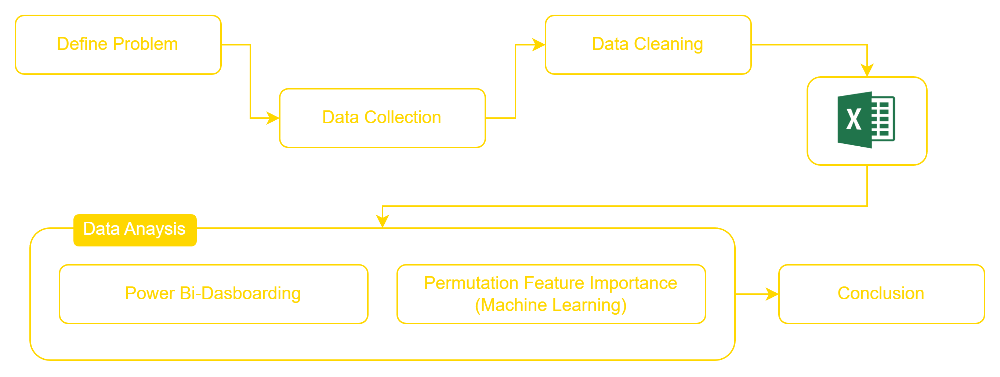

# 📊 Shopee Earphone Market Analysis

End-to-end data analytics project: web scraping (Node.js) → data preprocessing (Python) → exploratory data analysis & dashboard (Power BI).

---

## 🚀 Project Overview

Pasar earphone di Shopee Indonesia sangat kompetitif dengan ratusan produk dan toko yang bersaing pada berbagai rentang harga, spesifikasi, serta reputasi.

Proyek ini bertujuan untuk mengidentifikasi **strategi optimal bagi seller** dalam menentukan:
- Produk yang dijual
- Harga yang kompetitif
- Faktor utama yang memengaruhi penjualan

---

## 🎯 Main Business Question

> **Bagaimana seller dapat menentukan produk, harga, dan spesifikasi earphone yang optimal untuk memaksimalkan penjualan di Shopee?**

---

## 🧠 Methodology

<!--  -->

Proses analisis:
1. Data collection melalui scraping Shopee API
2. Data cleaning & transformation (Python)
3. Exploratory Data Analysis (EDA)
4. Data visualization & dashboard (Power BI)

---

## 📦 Dataset Summary

- **792 produk**
- **413 toko**
- Total penjualan: ~691.000 unit
- Total stok: ~66 juta unit

Dataset mencakup:
- Informasi produk (harga, rating, sold)
- Informasi toko (rating, lokasi, cancellation rate)
- Interaksi pengguna (komentar, like)

---

# 🔍 Key Insights

---

## 🎧 A. Produk & Positioning

### 🏆 Top Brand (Average Sales Performance)

- **Music Angel (Wired)**  
  Harga: Rp10.000 – Rp20.000  
  Total sold: **>255.000 unit**

- **Goojodoq (Wireless)**  
  Harga: Rp60.000 – Rp140.000  
  Total sold: **>132.000 unit**

- **Viclook (Wireless)**  
  Harga: Rp20.000 – Rp40.000  
  Total sold: **>15.000 unit**

- **Soundcare (Wireless)**  
  Harga: Rp140.000 – Rp280.000  
  Total sold: **>28.000 unit**

### 💡 Insight dari Tipe Produk:
- 3 dari 4 top brand merupakan **Wireless (TWS/Bluetooth)**
- Wireless mendominasi berbagai segmen harga
- Produk **wired tetap kuat di segmen ultra low price**

### 🎯 Insight:
> Pasar menunjukkan pergeseran ke arah **wireless**, namun **wired masih relevan untuk strategi volume di harga sangat rendah**

---

### 🎮 Gaming vs Non-Gaming

- **60% produk** menggunakan label Gaming
- Performa penjualan:
  - Gaming: ~34%
  - Non-Gaming: ~35%
  - Sisanya: tidak diketahui

### 💡 Insight:
> Label *Gaming* tidak secara signifikan meningkatkan penjualan, melainkan berfungsi sebagai strategi marketing (red ocean market)

---

## 💰 B. Strategi Harga

### 🎯 Dua Strategi Utama:

1. **Low Price Strategy (< Rp50.000)**
   - Volume tinggi
   - Margin tipis

2. **Mid-Range Strategy (Rp250.000 – Rp280.000)**
   - Rata-rata penjualan tertinggi
   - Sweet spot market

### 💡 Insight:
> Konsumen tidak selalu memilih yang termurah, tetapi mempertimbangkan **value dan kualitas produk**

---

## ⭐ C. Faktor Penentu Penjualan

### 🔥 1. Rating (Critical Threshold)
- Penjualan meningkat signifikan di **rating ≥ 4.5**
- Di bawah 4.0 → hampir tidak ada penjualan

---

### 💬 2. Review / Komentar
- Korelasi sangat kuat dengan penjualan
- Lebih konsisten dibanding like

👉 Semakin banyak review → semakin tinggi trust → semakin tinggi konversi

---

### 🎯 3. Diskon
- Optimal di **60% – 70%**
- Diskon kecil kurang efektif

---

## 🏪 D. Faktor Toko & Operasional

### 📍 Lokasi
- Didominasi oleh seller dari:
  - DKI Jakarta
  - Banten
  - Jawa Barat

👉 Faktor logistik berpengaruh besar

---

### ⚠️ Cancellation Rate
- Harus mendekati **0%**
- Sedikit kenaikan → penjualan turun drastis

---

### 🛡️ Garansi
- Mayoritas produk menggunakan **Garansi Distributor (~42%)**

---

# 📊 Dashboard

Dashboard terdiri dari 3 halaman utama:

### 1. Market Overview
- Distribusi harga
- Top brand
- Market composition

### 2. Shop Analysis
- Performa toko
- Lokasi
- Kredibilitas

### 3. Product Analysis
- Filtering produk advanced
- Spesifikasi detail (gaming, garansi, dll)

📁 File: `power-bi/shopee.pbix`  
🌐 Dashboard: [dashboard](https://app.powerbi.com/view?r=eyJrIjoiNzczM2M3NjMtZDJlZi00Mzg4LTg2ZGMtNTcyZmMzZTFiMDUzIiwidCI6IjFkNTE2OWFjLWM3Y2ItNDI3NS05NzY0LWJmOGM5YzM2NGE0YyIsImMiOjEwfQ%3D%3D)

---

# 💡 Final Business Recommendation

Untuk memaksimalkan penjualan:

- 🎧 Fokus pada produk **Wireless (TWS/Bluetooth)** untuk mengikuti tren pasar
- 💡 Gunakan produk **Wired** untuk strategi low-cost (volume tinggi)
- 💰 Gunakan pricing:
  - <50k (volume)
  - 250k–280k (optimal profit & demand)
- ⭐ Jaga rating **≥ 4.7**
- 💬 Tingkatkan jumlah review
- 🎯 Gunakan diskon **60–70%**
- ⚠️ Pastikan cancellation rate = 0%
- 📍 Optimalkan lokasi logistik (Jabodetabek)

---

# 🧠 Conclusion

Pasar earphone di Shopee tidak ditentukan oleh harga murah atau label produk semata, melainkan oleh kombinasi:

- **Trust (rating & review)**
- **Strategi harga**
- **Positioning produk**
- **Efisiensi operasional toko**

---

## 📬 Contact

**Author:** Erick Delenia  
📧 Email: erickdelenia08@email.com  
📷 Instagram: https://instagram.com/ercdel  

---

Project ini dibuat sebagai portofolio untuk posisi **Data Analyst**.